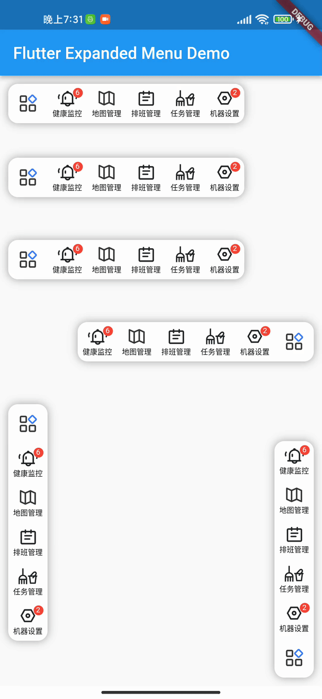

# flutter_expanded_menu

An expanded/collapsed menu widget for flutter.

## Preview



## Getting started

1. Add the following code to your app's pubspec.yaml file:

```yaml
dependencies:
  flutter_expanded_menu: 0.0.1
```

2. Import the package into your dart code:

```dart
import 'package:flutter_expanded_menu/flutter_expanded_menu.dart';
```

## Example

```dart
ExpandedMenuWidget<Item>(
  size: 48,
  direction: Axis.horizontal,
  anchorDirection: AxisDirection.left,
  itemsContainerAlignment: Alignment.topLeft,
  menuItems: items,
  notifier: notifier,
  itemBuilder: (_, index, item) => ItemWidget(data: item),
  anchorBuilder: (_, items, isExpand) => AnchorWidget(items: items, isExpand: isExpand),
  onAnchorTap: (isExpand) {},
  onItemTap: (item) {},
)
```

## License

```
Copyright (c) 2023, porum

Licensed under the Apache License, Version 2.0 (the "License");
you may not use this file except in compliance with the License.
You may obtain a copy of the License at

   http://www.apache.org/licenses/LICENSE-2.0

Unless required by applicable law or agreed to in writing, software
distributed under the License is distributed on an "AS IS" BASIS,
WITHOUT WARRANTIES OR CONDITIONS OF ANY KIND, either express or implied.
See the License for the specific language governing permissions and
limitations under the License.
```
